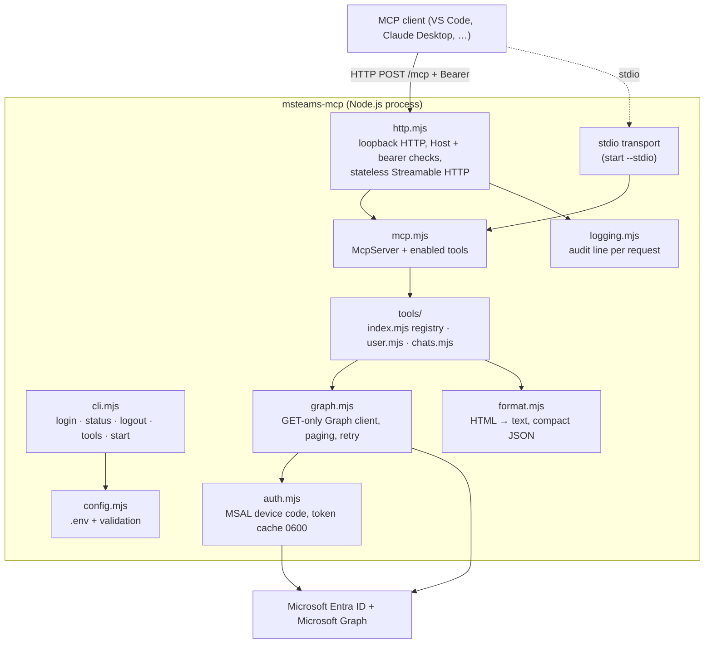

# Architecture

## Components



Dependencies (all MIT): `@modelcontextprotocol/sdk` (MCP protocol), `@azure/msal-node` (Microsoft sign-in,
token refresh), `zod` (input validation). Everything else is this project's code. Versions are pinned
exactly in `package.json` and `package-lock.json`.

## Modules and functions

| Module | Function | Purpose |
|---|---|---|
| `config.mjs` | `loadDotEnv(path?)` | Read `.env` (KEY=VALUE); existing environment variables win |
| | `loadConfig(env)` | Build config, return `{config, errors}`; TENANT_ID / CLIENT_ID required, no multi-tenant aliases |
| | `httpConfigErrors(config)` | HTTP-only rules: loopback host, access token ≥ 32 chars |
| `auth.mjs` | `createAuth(config, scopes)` | MSAL public client for one tenant + one app; file token cache |
| | `.login(onCode)` | Device code sign-in; keeps only the newly signed-in account |
| | `.getAccessToken()` | Silent token (refresh token); explains when re-login is needed |
| | `.username()` / `.status()` | Signed-in account; granted scopes and expiry |
| | `.logout()` | Remove accounts and delete the cache file |
| `graph.mjs` | `createGraph(getToken, opts)` | Microsoft Graph client |
| | `.get(pathOrUrl)` | **GET only**; refuses non-Graph URLs; retries 429/503/504 with Retry-After |
| | `.getPaged(path, {max, maxPages, stop})` | Follows `@odata.nextLink` with hard limits |
| `format.mjs` | `htmlToText(html)` | Teams HTML → text (mentions, links, lists, attachments, images, entities) |
| | `summarizeMessage(m, {format})` | chatMessage → compact JSON; deleted messages have no body |
| | `summarizeChat(c)` | chat → compact JSON (members ≤ 20, last message preview ≤ 200 chars) |
| `tools/index.mjs` | `TOOLS` | Registry of all tool objects |
| | `selectTools(names, {allowWriteTools})` | Validate ENABLED_TOOLS; refuse unknown names and un-approved write tools |
| | `requiredScopes(tools)` | Union of scopes of enabled tools + `User.Read` → what login requests |
| | `registerTools(server, tools, ctx)` | Register on McpServer; errors → friendly `isError` result |
| | `describeError(e)` | 401/403/404/timeout → actionable text, no secrets |
| `tools/user.mjs` | `authStatus`, `getCurrentUser` | Identity tools |
| `tools/chats.mjs` | `listChats`, `getChatMessages` | Chat tools (all via `/me/...`) |
| `mcp.mjs` | `createMcpServer(tools, ctx)` | McpServer with only the enabled tools |
| `http.mjs` | `startHttpServer(config, build, deps)` | HTTP listener with checks → Streamable HTTP transport |
| | `isHostAllowed(req, port)` / `isAuthorized(req, token)` | DNS-rebinding guard / constant-time bearer check |
| `logging.mjs` | `createLogger(file)` | stderr + optional JSON lines (0600) |
| | `argSummary(args)` / `resultSummary(body)` | Safe argument summary (no free text) / ok-error-count |
| | `createClientRegistry()` | Client name + version from `initialize` |
| `cli.mjs` | `login`, `status`, `logout`, `tools`, `start [--stdio]` | Command line |
| `scripts/selftest.mjs` | — | Checks a running server (security + optional live calls) |

## Tools (v0.1)

| Tool | Scope | Graph request | Arguments |
|---|---|---|---|
| `auth_status` | – | none (token cache) | – |
| `get_current_user` | `User.Read` | `GET /me?$select=…` | – |
| `list_chats` | `Chat.Read` | `GET /me/chats?$expand=members,lastMessagePreview&$orderby=lastMessagePreview/createdDateTime desc&$top=50` | `limit` 1–50, `chatType`, `topicContains` |
| `get_chat_messages` | `Chat.Read` | `GET /me/chats/{id}/messages?$top=50&$orderby=createdDateTime desc` (+ paging) | `chatId`, `limit` 1–200, `since`, `until`, `fromName`, `order`, `includeSystemMessages`, `format` |

All data requests go through `/me/…`, so results are always limited to what the signed-in user can see.
Filters (`since`, `until`, `fromName`, `chatType`, `topicContains`) are applied in the server while paging
newest → oldest, with hard page limits.

## Request flow (HTTP)

1. Client sends `POST /mcp` with `Authorization: Bearer <MCP_ACCESS_TOKEN>`.
2. `http.mjs` checks Host → path → token → method; rejects with 403/404/401/405 (logged).
3. A new `McpServer` (only enabled tools) + stateless transport handle the JSON-RPC message.
4. For `tools/call`: zod validates arguments → tool handler → `graph.get` (token from `auth`, refreshed
   silently) → `format` → JSON text result. Errors become `isError` results with explanatory text.
5. After the response, one audit line is logged (account, client, tool, safe args, status, count, ms, KB).

## Sign-in flow (device code)

1. `npm run login` → MSAL asks Entra for a device code for `CLIENT_ID` in `TENANT_ID` with the scopes of the
   enabled tools.
2. The user opens the verification URL, enters the code, signs in (password + MFA only on Microsoft's
   page) and consents **for themselves**.
3. Entra returns tokens to the waiting process only; MSAL stores them in the 0600 cache file.
4. The server later refreshes access tokens silently; if scopes change or the refresh token expires,
   tools answer "run npm run login".

## Adding a tool

1. Write a tool object (e.g. in `src/tools/channels.mjs`):
   ```js
   export const listChannels = {
     name: "list_channels",
     title: "List channels of a team",
     description: "…what it returns and when to use it…",
     access: "read",                                   // "write" requires ALLOW_WRITE_TOOLS=true
     scopes: ["Channel.ReadBasic.All"],                 // delegated scopes it needs
     inputSchema: { teamId: z.string().uuid() },
     async handler({ teamId }, { graph }) {
       const { items } = await graph.getPaged(`/teams/${encodeURIComponent(teamId)}/channels`, { max: 100 });
       return { count: items.length, channels: items.map((c) => ({ id: c.id, name: c.displayName })) };
     },
   };
   ```
2. Add it to `TOOLS` in `src/tools/index.mjs`.
3. Add the scope to the Entra app (API permissions → Delegated); get admin consent if the scope requires it.
4. Enable it: `ENABLED_TOOLS=…,list_channels` → `npm run login` (new scope) → restart → `npm run selftest -- --live`.
5. Update `docs/DATA-FLOW.md` (what the new tool returns to the AI) and the tool table above.

Write tools additionally need an explicit Graph method in `graph.mjs` (it is GET-only by design) and a
separate security review (see `docs/ROADMAP.md`).
