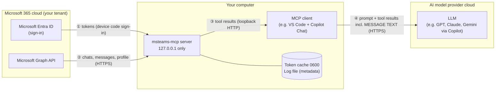

# Data flow — what data goes where

This page is written for security / privacy reviews. It lists every place data travels to or is stored,
**including the cloud AI model**, which is usually the most important point for an organization.

## Summary

> **Teams message content that a tool returns is sent to the AI model used by your MCP client.**
> With a cloud-hosted model (GitHub Copilot, Claude, ChatGPT, Gemini, …) that means the text leaves your
> machine and is processed by the model provider under the terms of your plan with that provider.
> msteams-mcp itself sends nothing anywhere except to Microsoft Graph.

## Every data path

| # | From → To | What | Where it lives | Controlled by |
|---|---|---|---|---|
| ① | Entra ID → server | Access token (~1 h) + refresh token for **the signed-in user only** | Token cache file on disk, `0600` (`~/.msteams-mcp/token-cache.json`) | You (logout deletes it); Entra admin (revoke sessions, disable app) |
| ② | Microsoft Graph → server | Profile (name, UPN, mail, job title, department, office); chat list (topic, type, **member display names**, **last message preview**); messages (**body text**, sender name, time, attachment names, mention names) | In memory only, per request; not stored by the server | Delegated scopes of the enabled tools (`Chat.Read`, `User.Read`) |
| ③ | Server → MCP client | The same data as JSON (tool results) | Loopback only (127.0.0.1), bearer-token protected; never leaves the machine on this hop | `MCP_ACCESS_TOKEN`, `ENABLED_TOOLS` |
| ④ | MCP client → **AI model provider (cloud)** | Your prompt, the tool list/descriptions, arguments chosen by the model, and **the full tool results — i.e. Teams message text, names, chat topics** | Provider's cloud, processed (and possibly retained/logged) according to **your plan's terms** | Your organization's AI policy / contract with the provider (e.g. GitHub Copilot Business/Enterprise), model choice |
| ⑤ | Server → disk | Request log: time, tool name, **argument summary without free text** (ids shortened, text reduced to its length), result status, item count, duration, size, account, client name | stderr; optional `LOG_FILE` (JSON lines, `0600`) | `LOG_FILE` setting; no message content is ever logged |
| ⑥ | Entra ID (Microsoft) | Sign-in events for the app | Entra **Sign-in logs** | Entra admin |

**Not sent anywhere:** no telemetry, analytics, update checks or calls to the project author or any third
party. The only outbound network destinations of the server are `login.microsoftonline.com` (sign-in, token
refresh) and `graph.microsoft.com` (data). The Graph client refuses any other URL.

## What the AI provider can see — by tool

| Tool | Data returned to the AI |
|---|---|
| `auth_status` | Account UPN and name, tenant id, app id, granted scopes, token expiry time (no token) |
| `get_current_user` | id, display name, UPN, mail, job title, department, office location |
| `list_chats` | chat id, type, topic, created/updated times, **member display names (max 20)**, **last message preview (max 200 chars)** and its sender |
| `get_chat_messages` | per message: id, time, sender name/type, **full body text**, subject, importance, edited/deleted flags, reply id, attachment names, mention names, reaction count |

The volume is bounded by the tool limits (chats ≤ 50 per call, messages ≤ 200 per call) and by what the
model asks for.

## Questions a security review should answer

1. **Is the AI provider approved for this data classification?** Teams chats may contain personal data,
   customer data, credentials pasted by users, HR topics, etc. Treat tool results like any content pasted
   into the AI chat.
2. **Which plan / contract applies?** Check the provider's data handling for your plan: retention of
   prompts and responses, use for model training, data residency, sub-processors. Enterprise plans often
   differ from individual ones.
3. **Which model is selected in the client?** The same client (e.g. VS Code Copilot) can route to models
   from different vendors; each may have different terms.
4. **Who may use it?** Only users assigned to the Entra app (Assignment required = Yes) can sign in.
5. **Local alternative:** an MCP client using a locally hosted model keeps path ④ on the machine.

## Residual risks and mitigations

| Risk | Mitigation |
|---|---|
| Sensitive chat content reaches the cloud model | Enable only needed tools; ask for small limits; approved enterprise AI plan or local model; user awareness |
| **Prompt injection**: a chat message contains text like "ignore previous instructions…" and the model follows it | Read-only tools only (no send/delete/share capability exists), so an injected instruction cannot act in Teams. Keep write tools disabled unless separately reviewed |
| Refresh token theft from disk | File `0600` in the user's home; full-disk encryption; `npm run logout` when not needed; Entra: revoke sessions / disable app |
| Another local process calls the server | 32+ char bearer token required; loopback-only binding; Host header check |
| Server exposed on the network | Refuses to start on non-loopback addresses |
